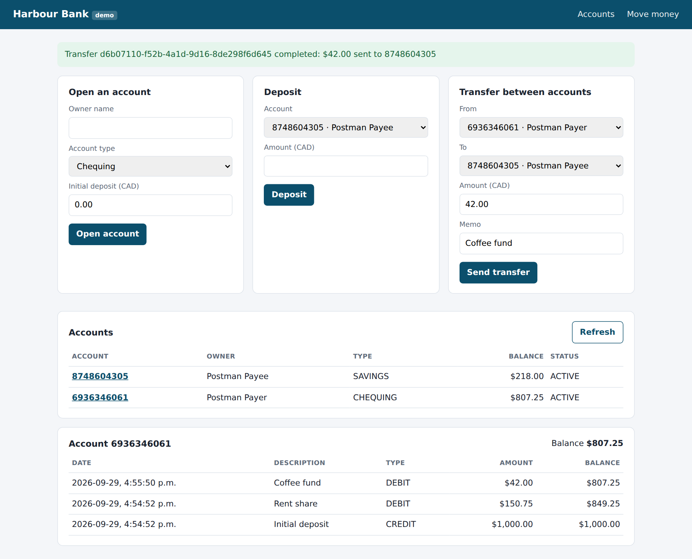
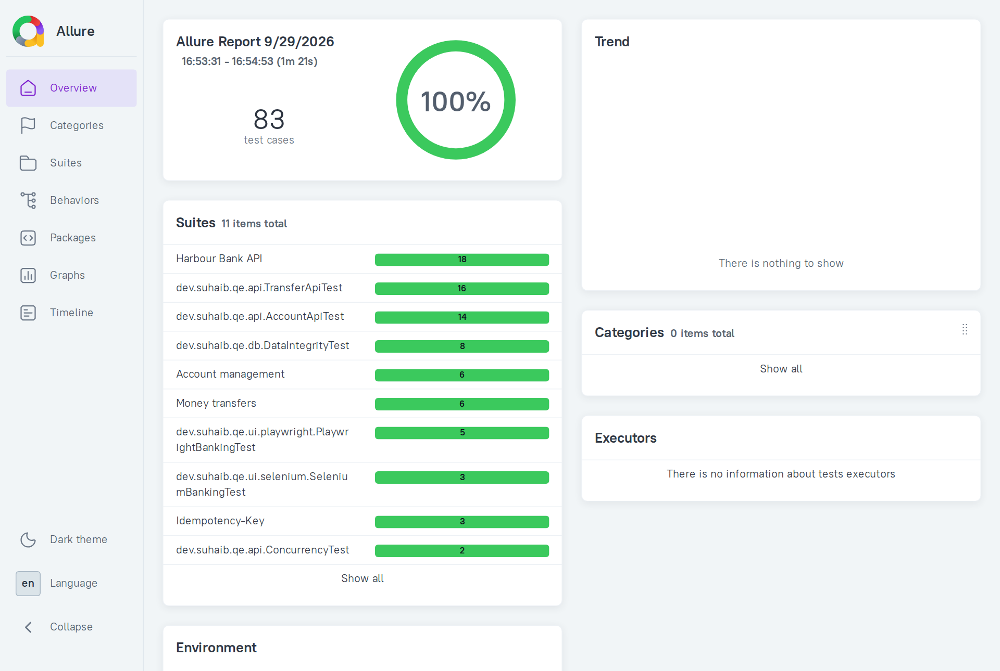

# Harbour Bank QE Framework

[](https://github.com/suhaibsdkhan/Harbour-bank-qe-framework/actions/workflows/ci.yml)
[](https://suhaibsdkhan.github.io/Harbour-bank-qe-framework/)


An end-to-end test automation framework for a small banking system, built the way a bank's QE team would build it.
It includes the system under test, a Spring Boot banking API with a web UI, so every layer can be tested for real:
REST contracts, business rules, the database, the browser and concurrency. CI runs everything on every push and
publishes one Allure report. Every main-branch run is also sent to the
**[Secure Test Results Dashboard](https://github.com/suhaibsdkhan/secure-test-dashboard)**, which tracks pass-rate
trends, flaky tests and slow tests across runs.

**Live reports from the latest `main` build:** [Allure test report](https://suhaibsdkhan.github.io/Harbour-bank-qe-framework/) ·
[Code coverage](https://suhaibsdkhan.github.io/Harbour-bank-qe-framework/coverage/) · [Gatling load test](https://suhaibsdkhan.github.io/Harbour-bank-qe-framework/performance/) ·
[Test strategy](docs/TEST_STRATEGY.md)

| | |
|---|---|
|  |  |

## What it covers

| Layer | Tooling | What is tested |
|---|---|---|
| Unit | **JUnit 5**, **Mockito**, `@WebMvcTest` | Transfer rules, lock ordering and HTTP error mapping in isolation |
| API | **Rest Assured**, **JUnit 5**, JSON Schema | Contracts, status codes, RFC 7807 error bodies, boundary values, idempotency |
| BDD | **Cucumber** (Gherkin, PicoContainer) | Business-readable scenarios for accounts, transfers and online banking |
| UI | **Playwright** and **Selenium WebDriver** | The same web app driven by both tools through page objects; Selenium runs on Chrome and Firefox |
| Accessibility | **axe-core** (Playwright) | WCAG 2.1 AA scan of the page, including success and error states |
| Data | **SQL over JDBC** | Double-entry ledger, reconciliation, audit rows, running balances |
| Contract | **Postman** collection run by **Newman** | A second, tool-independent regression pack for the API |
| Concurrency | JUnit + thread pool | No overdraft under parallel withdrawals, no deadlock on opposite transfers |
| Performance | **Gatling** | Load test with SLA assertions (p95 < 500 ms, < 1% errors), balance checked under load, ledger reconciled afterwards |
| Coverage | **JaCoCo** | Unit + end-to-end coverage of the app, merged; CI fails below 90% lines / 85% branches |
| Reporting | **Allure** | One report merging JUnit, Cucumber and Newman, with HTTP logs, SQL, screenshots and Playwright traces |
| Environments | **Docker**, **Docker Compose** | App and Postgres run in containers for the load test, like a shared QA environment |
| CI | **GitHub Actions** | Five parallel jobs, Postgres service container, nightly run, reports published to GitHub Pages |

About 100 automated checks and a load test run in parallel on every push. Current bank-app coverage is
about 99% of lines and 92% of branches.

See [docs/TEST_STRATEGY.md](docs/TEST_STRATEGY.md) for the risk ranking, test pyramid, design techniques
and requirement-to-test traceability.

## The system under test: Harbour Bank

A small Spring Boot 3.5 / Java 21 API with a plain HTML+JS front end (`bank-app/`).

| Endpoint | Purpose |
|---|---|
| `POST /api/accounts` | Open a chequing or savings account, optionally with an initial deposit |
| `GET /api/accounts`, `GET /api/accounts/{number}` | List or look up accounts |
| `POST /api/accounts/{number}/deposits` | Deposit money |
| `POST /api/accounts/{number}/freeze` | Freeze an account (fraud hold) |
| `GET /api/accounts/{number}/transactions` | Ledger history, newest first |
| `POST /api/transfers` | Move money; supports an `Idempotency-Key` header |
| `GET /api/transfers/{reference}` | Look up a transfer, including rejected ones |

Banking rules the tests pin down:

- Money is `NUMERIC(19,2)`; amounts must be positive with at most two decimals.
- Every transfer writes exactly one DEBIT and one CREDIT ledger entry (double-entry bookkeeping).
- Rejected transfers (`INSUFFICIENT_FUNDS`, `LIMIT_EXCEEDED` above $10,000, `ACCOUNT_FROZEN`, `SAME_ACCOUNT`) are
  stored with a reason for audit and never move money.
- Retrying a transfer with the same `Idempotency-Key` returns the original result instead of charging twice;
  reusing a key with a different payload is a `409`.
- Accounts are locked in a fixed order during a transfer, so concurrent transfers cannot overdraw or deadlock.

## Framework design

```
bank-app/        Spring Boot app, plus its unit and web-slice tests
bank-perf/       Gatling load simulation (TransferLoadSimulation)
bank-tests/      End-to-end framework:

bank-tests/src/test/java/dev/suhaib/qe
├── config/       TestConfig: one place for every setting (system property or env var)
├── support/      AppLauncher: boots the bank in-process unless -Dbase.url points at an environment
├── api/          BankApi client (Rest Assured + Allure logging) and API/concurrency tests
├── db/           BankDb (JDBC, SQL attached to the report) and data-integrity tests
├── ui/playwright PlaywrightExtension (browser per JVM, context per test, trace on failure), page object,
│                 journeys and axe-core accessibility scans
├── ui/selenium   DriverFactory, SeleniumExtension (screenshot + page source on failure), page object, tests
├── bdd/          Cucumber runner, ScenarioContext (DI), step definitions
└── data/         Unique test data per test; no shared fixtures, no test order dependencies
```

Choices worth calling out:

- **Environment-agnostic.** By default the tests boot the app on a random port with an in-memory database, so
  `mvn verify` works on a fresh clone. Pass `-Dbase.url` and `-Ddb.url` to run the same suite against a deployed
  environment instead.
- **Arrange through the API, assert through the UI.** UI tests create their accounts over REST (fast, reliable)
  and only use the browser for the behaviour under test.
- **Stable locators.** The UI exposes `data-testid` attributes; no XPath or CSS tied to layout.
- **No sleeps.** Playwright auto-waits; Selenium uses explicit `WebDriverWait` conditions only.
- **Whole-database invariants.** The SQL checks run over every row, so they also catch damage done by any other
  test in the same run.
- **Failure evidence.** Failed UI tests attach a screenshot and a Playwright trace (or page source for Selenium);
  every API call attaches its request and response; every SQL check attaches its query.
- **Tags everywhere.** JUnit `@Tag` and Cucumber tags (`api`, `db`, `ui`, `playwright`, `selenium`, `smoke`)
  let CI or a developer run any slice.

## Running it locally

Requirements: Java 21. Node 20+ only for the Postman suite and the report.

```bash
./mvnw verify                                   # everything: API, SQL, Cucumber, Playwright, Selenium
./mvnw verify -pl bank-tests -Dgroups=api       # only API tests (JUnit and Cucumber @api)
./mvnw verify -pl bank-tests -Dgroups=ui -Dheadless=false        # watch the browsers
./mvnw verify -pl bank-tests -Dgroups=smoke     # the Cucumber @smoke scenarios
./mvnw verify -pl bank-tests -Dgroups=selenium -Dselenium.browser=firefox
./mvnw verify -pl bank-tests -Dgroups=a11y       # accessibility scans only
```

Against Postgres or a deployed environment:

```bash
./mvnw install -DskipTests
./mvnw verify -pl bank-tests \
  -Ddb.url=jdbc:postgresql://localhost:5432/bank -Ddb.user=bank -Ddb.password=bank

./mvnw verify -pl bank-tests -Dbase.url=https://qa.example.com -Ddb.url=...   # no local app is started
```

Run the app in Docker with Postgres, then load-test it and check the ledger afterwards:

```bash
./mvnw install -DskipTests && docker compose up -d --build --wait
./mvnw -pl bank-perf gatling:test -Dusers=20 -DdurationSeconds=60     # report in bank-perf/target/gatling
./mvnw verify -pl bank-tests -Dgroups=db -Dbase.url=http://localhost:8080 \
  -Ddb.url=jdbc:postgresql://localhost:5432/bank -Ddb.user=bank -Ddb.password=bank
```

Run the app and the Postman collection:

```bash
./mvnw -pl bank-app spring-boot:run              # http://localhost:8080
npm ci && npm run test:postman
```

Build the Allure report locally:

```bash
mkdir -p allure-results && cp bank-tests/target/allure-results/* target/allure-results-newman/* allure-results/
npm run report && npm run report:open
```

## CI pipeline

`.github/workflows/ci.yml` runs on every push, every pull request and nightly:

1. **java-tests**: unit tests, then JUnit and Cucumber (API, SQL, Playwright, Selenium on Chrome, axe-core)
   against a Postgres 16 service container. It merges JaCoCo coverage and enforces the coverage gate.
2. **selenium-firefox**: the Selenium suite again in Firefox.
3. **postman**: starts the packaged app and runs the Postman collection with Newman.
4. **performance**: starts the app and Postgres with Docker Compose, runs the Gatling simulation (SLA
   assertions fail the job), then runs the SQL reconciliation against the database the load just hit.
5. **report**: merges Allure results from every job, carries over trend history, adds failure categories,
   writes a summary to the job page, and bundles the coverage and Gatling reports.
6. **deploy**: publishes everything to GitHub Pages from `main`.
7. **publish-results**: on `main`, merges the Surefire reports into JUnit files with `scripts/merge-junit.mjs`
   (dropping JVM properties and console output) and uploads them, plus the Newman report, to the
   [test results dashboard](https://github.com/suhaibsdkhan/secure-test-dashboard) as `harbour-bank-unit`,
   `harbour-bank-e2e` and `harbour-bank-postman`. Failed runs are uploaded too. It skips until you set a
   `DASHBOARD_URL` repository variable and a `DASHBOARD_INGEST_TOKEN` secret.

To enable the Pages step on a fork: *Settings → Pages → Build and deployment → Source: GitHub Actions*.

## Tech stack

Java 21 · Maven · Spring Boot 3.5 · JUnit 5 · Mockito · Cucumber 7 · Rest Assured 5 · Playwright 1.56 ·
Selenium 4 · axe-core · Gatling · JaCoCo · PostgreSQL 16 / H2 · Docker Compose · Postman + Newman · Allure 2 ·
GitHub Actions
